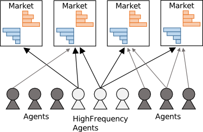

# Platform

本ソフトウェアは，人工市場シミュレーションのための開発・実行の基盤すなわちプラットフォームを提供する．

人工市場シミュレーションを行う前に，研究開発者は市場を構成する

  * トレーダエージェントの取引戦略
  * マーケット†および価格決定メカニズム
  * エージェントとマーケットの連携

などを含む，人工市場モデルを設計し，プログラムを書く必要がある．

> † 本ソフトウェアでは，現実における１つの銘柄を１つの「マーケット」として抽象化している．
> マーケットとはある特定の商品に関する取引システムに相当すると考えてほしい．

並列分散環境でシミュレーションを実行するには，上記に加えて，

  * データ配置の問題：計算ノード†にデータをどのように配置するか？
  * データ通信の問題：計算ノード間でデータの交換をどのように行うか？
  * タスク管理の問題：計算負荷をいかにして分散させるか？

といった問題を克服するため，シミュレーション開発・実行の基盤となる部分が必要である．
しかし，大規模並列シミュレーションの必要があったとしても，人工市場を使う研究者（金融・経済の分野だろう）にとっては，並列分散環境に合わせたプログラムを書くことは労力のかかる作業といえる．
また，並列分散環境では，上記の問題のため，率直な並列プログラムでは期待通りの性能をえられないことが多い．
この状況を克服するには，人工市場を使う研究者が計算機科学の専門家と連携し，実現可能な解を探索することが要求される．
本ソフトウェアは，この問題に対してひとつの解決策となるシミュレーション開発・実行の基盤を提供する．

<!--
> **要修正**
> † 計算ノードとは１つの CPU だと考えてほしい．
> 現代では，１つの CPU は複数のコアからなる（デュアルコア，クアッドコア）．
> そして，各コアは複数のスレッドをもつ．
> たとえば，クアッドコア（4 コア） × 2 スレッドの CPU ならば，最大 8 個のプロセスを並列実行できる．
> したがって，１つの計算ノードでも**並列実行**は可能である．
> これに対して，複数の計算ノードをインターネットを介して接続し，連携させてある特定のプログラムを実行することがある．
> この場合，複数の計算ノードで，必要なデータを「配置」したり，計算結果を「通信」することが必要となる．
> これを**並列分散実行**という．
> 本記事では，並列分散実行を区別せず，たんに並列実行ということもある．
-->

## Philosophy

本ソフトウェアは，人工市場シミュレーションを行う研究者（おもに経済系，工学系だろう）を主なユーザと想定している．
この目標のため，本ソフトウェアは「人工市場モデル」と「計算実行モデル」を分離している．

**人工市場モデル**：
エージェントシミュレーションの用語でいう「モデル」をさす．
金融・経済の分野の研究者が作成するのはこの意味でのモデルである．
この意味でのモデルは，エージェントの取引戦略，マーケットの注文処理，金融ショックや金融規制などを含む．

**計算実行モデル**：
他方，計算機科学の分野の研究者が開発するのは，「人工市場モデル」（あるいは「問題」）をいかに能率的に計算するか，その計算の実行方法に関する「モデル」である．
この意味でのモデルは，先に述べた，データ配置の問題，データ通信の問題，タスク管理の問題を含む．

この分離の導入によって，金融・経済の分野の研究者は計算技術の知識を十分にもたずとも技術を利用できる．
また，計算機科学の分野の研究者がより効率的な実行モデルを開発可能にする．

## Preview

下記の図は人工市場シミュレーションの概略である．
図では，４つのマーケット（銘柄†）を取引する複数のエージェントが描かれている．
マーケットは売りと買いに対応した板（オーダーブック）や価格の時系列といった情報をもつ．
エージェントはこれらの情報をもとに，注文価格，注文量などを決め，注文を行う．
エージェントからの注文はマーケットにより処理され，取引内容に応じて，次の時点の価格が決定される．
典型的な人工市場シミュレーション（逐次環境）では (i) エージェントの注文決定，(ii) マーケットの注文処理，が交互に繰り返される．

